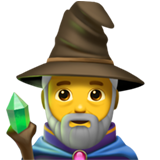

# `Sage Bar`

<div align="center">
    
</div>

Sage Bar is a macOS menu bar app for tracking AI usage, spend, quotas, and account health across local agents and connected provider accounts.

It is built around one always-available workflow: open the menu bar icon, see the current state of your accounts, and take action before usage or quota problems become expensive.

## Stack

...

## Screenshots

...

## Usage

Below are instructions for locally downloading and using `Sage Bar`.

1. First run the below to [install](./docs/INSTALL.md) `Sage Bar`'s source code.'

```console
$ git clone https://github.com/gongahkia/sage-bar && cd sage-bar
```

2. Alternatively download `Sage Bar`'s latest release from [GitHub Releases](https://github.com/gongahkia/sage-bar/releases).

3. Optionally execute the below commands to invoke `Sage Bar`'s core build functionality. 

```console
$ swift run SageBar # run immediately
$ make run # alternative run command

$ swift build # build the app
$ swift test # run the test suite
$ make bundle # create a local .app bundle

$ make verify-bundle # smoke-test the bundled app locally
$ make archive-release #create a release-style local archive
```


## Support

`Sage Bar` currently supports the following [local](#local-providers) and [remote](#remote-providers) AI providers.

### Remote providers

* Anthropic API
* OpenAI organization usage
* GitHub Copilot organization metrics
* Windsurf Enterprise analytics
* Claude AI session-based usage

### Local providers

* Claude Code local session logs
* Codex local session logs
* Gemini CLI local session logs